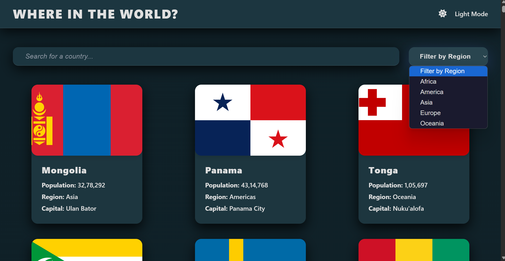

# 🌍 Country Explorer

A beautifully crafted React-based web app that allows users to explore detailed information about countries around the world using the [REST Countries API](https://restcountries.com/).

Live Demo: 👉 [Click to Visit](https://country-explorer-react-app.vercel.app/)

 
(./lightModePreview.png)

---

## ✨ Features

- 🌎 View country data like flag, capital, population, region, subregion, languages, and more
- 🔍 Search functionality for filtering countries by name
- 📍 Filter countries by region
- 💡 Responsive design for all screen sizes
- ⚡ Fast and minimal UI using React functional components and hooks

---

## 🛠️ Tech Stack

- **React JS**
- **React Router DOM**
- **REST Countries API**
- **CSS / Tailwind / Custom Styling** *(depending on your design)*
- **Vite (if used)** or **CRA**
- **Vercel** for deployment

---

